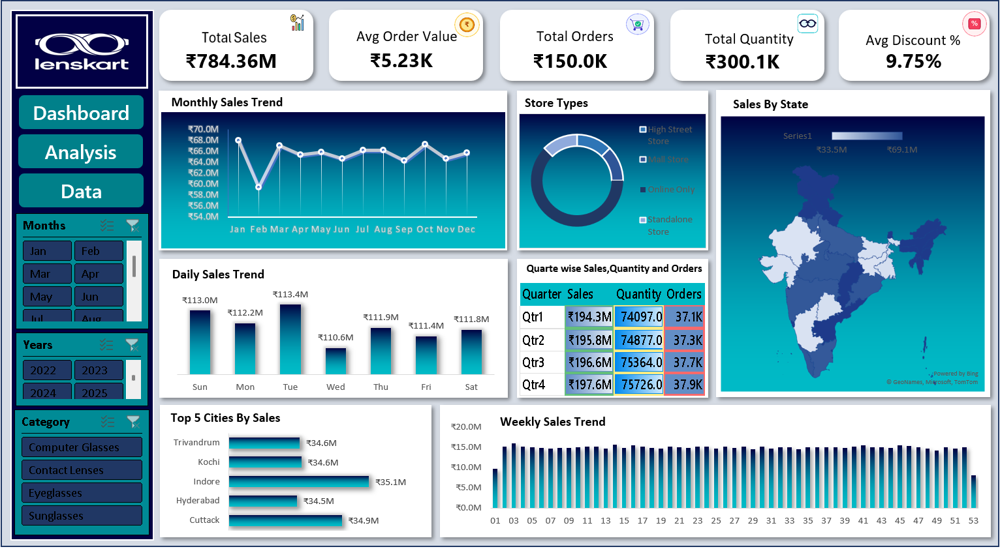

# Lenskart_Sales_Analysis_Dashboard

# 👓 Lenskart Omnichannel Sales & Operations Dashboard (Excel)

An executive-level Retail Business Intelligence dashboard analyzing **150,000+ omnichannel transactions** across India. Built entirely in Microsoft Excel using advanced Pivot Tables, dynamic calculated KPIs, custom number formatting, and interactive slicers.

---

## 📸 Dashboard Preview



---

## 📌 Executive Summary & Key Metrics

* **Total Net Sales:** ₹784.36M (Annualized revenue baseline across 23 cities)
* **Total Order Volume:** 150,000 Transactions
* **Total Units Sold:** 300,064 Units (Avg 2.0 items/basket)
* **Average Order Value (AOV):** ₹5,229
* **Average Discount Rate:** 9.75% (Strict promotion margin discipline)

---

## 🔍 Key Business Insights

1. **Omnichannel Store Performance:**
   * Online sales accounted for ~50.1% of volume, while offline physical stores (Mall Stores, High Street, Standalone) delivered 49.9%—demonstrating effective omnichannel penetration.
2. **Geographical Reach:**
   * Strong Pan-India footprint across 16 states and 23 cities, led by high sales velocities in tier-1/tier-2 hubs including Indore, Cuttack, Kochi, Trivandrum, and Hyderabad.
3. **Category Equilibrium:**
   * Revenue split across Eyeglasses (25.2%), Contact Lenses (25.0%), Sunglasses (24.9%), and Computer Glasses (24.9%) indicates balanced demand with minimal portfolio risk.
4. **Sales Cadence:**
   * Day-of-week sales remain highly stable (~₹111M–₹113M per day) with consistent order placement across all working and weekend days.

---

## 🛠️ Technical Excel Features Used

* **Pivot Tables & Calculated Fields:** Dynamic aggregations, multi-level row grouping, and custom summary calculations.
* **Custom Number Formatting:** Standardized metric displays (`₹#,##0.00,,"M"` for Crores/Millions, `#,##0.0,"K"`, and fixed percentages).
* **Interactive Slicers:** Connected cross-filtering for *Year, Sales Channel, Product Category,* and *Geographies*.
* **UI/UX Design:** Custom branding palette (Lenskart Navy `#000042` & Teal `#00BAC6`), soft card containers, visual iconography, and eliminated gridlines.

---

## 📂 Project Structure

```text
├── Lenskart_Dashboard_Project.xlsx   # Main Excel Workbook (Pivots + Dashboard)
├── Lenskart_Dashboard.png            # High-resolution dashboard screenshot
└── README.md                         # Executive project documentation
├── dashboard_preview.png             # High-resolution dashboard screenshot
└── README.md                         # Executive project documentation
